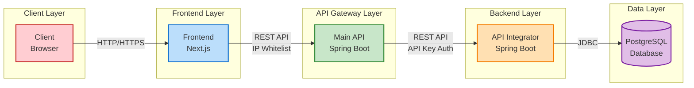
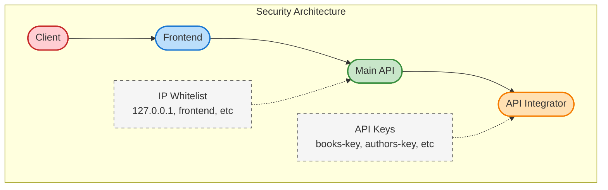

# Library Management System

Sistem manajemen perpustakaan dengan arsitektur microservices.

## Arsitektur Sistem

Sistem ini terdiri dari beberapa komponen:

1. **Database PostgreSQL**: Penyimpanan data untuk aplikasi
2. **API Integrator**: Layanan Java Spring Boot yang menangani akses langsung ke database
3. **Main API**: Layanan Java Spring Boot yang bertindak sebagai API Gateway dengan keamanan IP statis
4. **Frontend**: Aplikasi Next.js untuk antarmuka pengguna

### System Design & Architecture



#### Alur Data & Komunikasi

1. **Client** mengakses aplikasi melalui browser
2. **Frontend (Next.js)** menyajikan UI dan mengirim request ke Main API
3. **Main API** melakukan:
   - Validasi IP (hanya menerima request dari IP yang diizinkan)
   - Meneruskan request ke API Integrator dengan API key yang sesuai
   - Menangani circuit breaking dan retry jika API Integrator tidak tersedia
4. **API Integrator** melakukan:
   - Validasi API key
   - Operasi CRUD pada database
   - Mengembalikan respons ke Main API
5. **PostgreSQL Database** menyimpan semua data aplikasi

#### Arsitektur Keamanan



#### Komponen Detail

1. **Frontend (Next.js)**
   - Aplikasi Single Page Application berbasis React
   - Tailwind CSS untuk styling
   - Pages untuk navigasi antar halaman
   - Components untuk UI yang reusable
   - API client untuk komunikasi dengan Main API

2. **Main API (Java Spring Boot)**
   - API Gateway yang meneruskan request ke API Integrator
   - Security dengan IP Whitelist
   - Circuit Breaker dengan Resilience4j
   - Controllers untuk setiap domain (Books, Authors, Borrowed Books)
   - Swagger UI untuk dokumentasi API

3. **API Integrator (Java Spring Boot)**
   - Layanan backend yang melakukan akses database
   - Security dengan API Key
   - Controllers, Services, dan Repositories
   - Model/Entity untuk representasi data
   - Swagger UI untuk dokumentasi API

4. **Database PostgreSQL**
   - Tabel untuk Books, Authors, Members, dan Borrowed Books
   - Relasi antar entitas
   - Indeks untuk performa query

## Struktur Proyek

```
library-book/
├── api_integrator/   # Integrator API dengan Java Spring Boot
├── main_api/         # Main API dengan Java Spring Boot dan IP security
├── frontend/         # Frontend dengan Next.js
├── docker-compose.yml # Konfigurasi Docker Compose
```

## Prasyarat

- Docker dan Docker Compose
- JDK 17 (untuk pengembangan lokal)
- Node.js 18+ (untuk pengembangan frontend lokal)

## Cara Menjalankan

### Menggunakan Docker Compose

1. Pastikan Docker dan Docker Compose terinstal
2. Sesuaikan nilai di file `.env` jika diperlukan
3. Jalankan semua layanan:

   ```bash
   docker-compose up -d
   ```

4. Untuk menghentikan semua layanan:

   ```bash
   docker-compose down
   ```

### Akses Layanan

- Frontend: http://localhost:3000
- Main API: http://localhost:8090/api
- API Integrator: http://localhost:8080 (tidak diakses langsung oleh klien)
- Swagger UI untuk Main API: http://localhost:8090/api/swagger-ui.html
- Swagger UI untuk API Integrator: http://localhost:8080/swagger-ui.html

## Pengembangan Manual Tanpa Docker

### API Integrator

   ```bash
cd api_integrator
mvn spring-boot:run
```

### Main API

   ```bash
cd main_api
   mvn spring-boot:run
   ```

### Frontend

   ```bash
   cd frontend
   npm install
   npm run dev
   ```

## Keamanan

- Main API menggunakan keamanan berbasis IP (whitelist) untuk membatasi akses hanya dari frontend
- API Integrator menggunakan API keys untuk otentikasi yang berbeda untuk setiap endpoint
- Main API bertindak sebagai proxy yang menggunakan API keys yang sesuai saat mengakses API Integrator

## Environment Variables

Semua konfigurasi dapat disesuaikan melalui file `.env` pada masing-masing folder proyek.