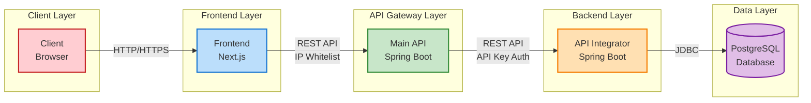
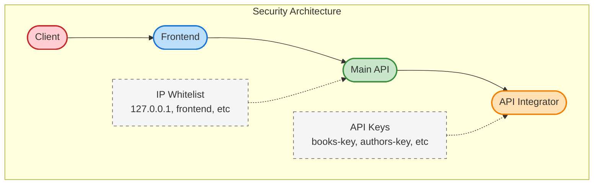

# Library Management System

A microservices-based library management system.

## System Architecture

The system consists of several components:

1. **PostgreSQL Database**: Data storage for the application
2. **API Integrator**: Java Spring Boot service that handles direct database access
3. **Main API**: Java Spring Boot service that acts as an API Gateway with static IP security
4. **Frontend**: Next.js application for the user interface

### System Design & Architecture



#### Data Flow & Communication

1. **Client** accesses the application through a browser
2. **Frontend (Next.js)** presents the UI and sends requests to the Main API
3. **Main API** performs:
   - IP validation (only accepting requests from allowed IPs)
   - Forwarding requests to the API Integrator with the appropriate API key
   - Handling circuit breaking and retry if the API Integrator is unavailable
4. **API Integrator** performs:
   - API key validation
   - CRUD operations on the database
   - Returning responses to the Main API
5. **PostgreSQL Database** stores all application data

#### Security Architecture



#### Component Details

1. **Frontend (Next.js)**
   - React-based Single Page Application
   - Tailwind CSS for styling
   - Pages for navigation between screens
   - Reusable UI components
   - API client for communication with the Main API

2. **Main API (Java Spring Boot)**
   - API Gateway that forwards requests to the API Integrator
   - Security with IP Whitelist
   - Circuit Breaker with Resilience4j
   - Controllers for each domain (Books, Authors, Borrowed Books)
   - Swagger UI for API documentation

3. **API Integrator (Java Spring Boot)**
   - Backend service that performs database access
   - Security with API Key
   - Controllers, Services, and Repositories
   - Model/Entity for data representation
   - Swagger UI for API documentation

4. **Database PostgreSQL**
   - Tables for Books, Authors, Members, and Borrowed Books
   - Relationships between entities
   - Indexes for query performance

## Project Structure

```
library-book/
├── api_integrator/   # Integrator API with Java Spring Boot
├── main_api/         # Main API with Java Spring Boot and IP security
├── frontend/         # Frontend with Next.js
├── docker-compose.yml # Docker Compose configuration
```

## Prerequisites

- Docker and Docker Compose
- JDK 17 (for local development)
- Node.js 18+ (for local frontend development)

## How to Run

### Using Docker Compose

1. Make sure Docker and Docker Compose are installed
2. Adjust values in the `.env` file if needed
3. Run all services:

   ```bash
   docker-compose up -d
   ```

4. To stop all services:

   ```bash
   docker-compose down
   ```

### Service Access

- Frontend: http://localhost:3000
- Main API: http://localhost:8090/api
- API Integrator: http://localhost:8080 (not directly accessed by clients)
- Swagger UI for Main API: http://localhost:8090/api/swagger-ui.html
- Swagger UI for API Integrator: http://localhost:8080/swagger-ui.html

## Manual Development Without Docker

### API Integrator

```bash
cd api_integrator
mvn spring-boot:run
```

### Main API

```bash
cd main_api
mvn spring-boot:run
```

### Frontend

```bash
cd frontend
npm install
npm run dev
```

## Security

- Main API uses IP-based security (whitelist) to limit access only from the frontend
- API Integrator uses API keys for authentication with different keys for each endpoint
- Main API acts as a proxy that uses the appropriate API keys when accessing the API Integrator

## Environment Variables

All configurations can be customized through the `.env` file in each project folder.